# PMC-AUTO 관리자 사용설명서

## 목차

1. [시스템 개요](#시스템-개요)
2. [로그인](#로그인)
3. [사이드바 메뉴](#사이드바-메뉴)
4. [상품 관리 (대시보드)](#상품-관리-대시보드)
   - [탭 구조](#탭-구조)
   - [상단 툴바](#상단-툴바)
   - [액션바](#액션바)
   - [상품 테이블](#상품-테이블)
5. [CSV 업로드](#csv-업로드)
6. [데이터 미리보기 (Import)](#데이터-미리보기-import)
7. [업로드 진행](#업로드-진행)
8. [업로드 결과](#업로드-결과)
9. [히스토리](#히스토리)
10. [휴지통](#휴지통)
11. [설정](#설정)
12. [토큰 관리](#토큰-관리)
13. [직원 관리](#직원-관리)
14. [작업 로그](#작업-로그)

---

## 시스템 개요

PMC-AUTO는 한국 도매 플랫폼(쿠팡, ktown4u 등)에서 소싱한 상품을 **eBay, Shopify, Alibaba, Shopee**에 자동으로 리스팅하는 시스템입니다.

**주요 기능:**

- CSV 파일로 상품 데이터 일괄 임포트
- 플랫폼별 가격 자동 계산 (마진율 + 환율 + 수수료 + 배송비)
- 상품명 자동 번역 (Gemini API)
- 멀티 플랫폼 동시 리스팅
- 실시간 업로드 진행률 모니터링

**기술 스택:**

- 서버: Fastify + Eta 템플릿 (서버 렌더링)
- DB: Supabase PostgreSQL + Drizzle ORM

**사용자 역할:**

| 역할 | 권한 |
|------|------|
| **Admin** | 전체 시스템 관리 (설정, 토큰, 직원, 작업 로그 포함) |
| **Staff** | 할당된 상품만 관리 |

---

## 로그인

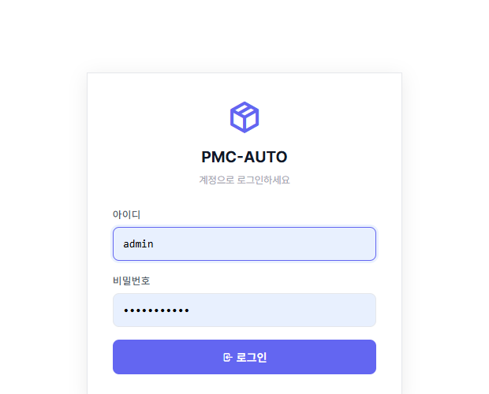

① **아이디 입력** — Admin 계정의 아이디를 입력합니다.
② **비밀번호 입력** — 비밀번호를 입력합니다.
③ **로그인 버튼** — 클릭하여 시스템에 접속합니다.

> **참고:** 비밀번호를 분실한 경우, 다른 Admin 계정에서 [직원 관리](#직원-관리) 페이지를 통해 비밀번호를 초기화할 수 있습니다.

---

## 사이드바 메뉴

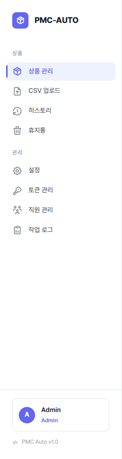

Admin 사용자에게는 두 개의 메뉴 섹션이 표시됩니다.

**상품 섹션:**

① **상품 관리** — 메인 대시보드 (전체/업로드 대기/업로드 완료/판매 취소)
② **CSV 업로드** — CSV 파일로 상품 데이터 임포트
③ **히스토리** — 업로드 기록 및 세션 잡 조회
④ **휴지통** — 삭제된 상품 복원 또는 완전 삭제

**관리 섹션 (Admin 전용):**

⑤ **설정** — 플랫폼별 가격 설정 (마진율, 환율, 수수료)
⑥ **토큰 관리** — 플랫폼 OAuth 토큰 상태 확인 및 갱신
⑦ **직원 관리** — 직원 계정 생성/수정/삭제
⑧ **작업 로그** — 전체 시스템 감사 로그

**하단:**

⑨ **사용자 정보** — 현재 로그인한 사용자의 아이디와 권한 표시
⑩ **로그아웃** — 세션 종료

> **참고:** Staff 사용자에게는 관리 섹션이 표시되지 않습니다.

---

## 상품 관리 (대시보드)

**URL:** `/`

메인 화면입니다. 페이지 제목은 "대시보드"이지만, 사이드바에서는 "상품 관리"로 표시됩니다.

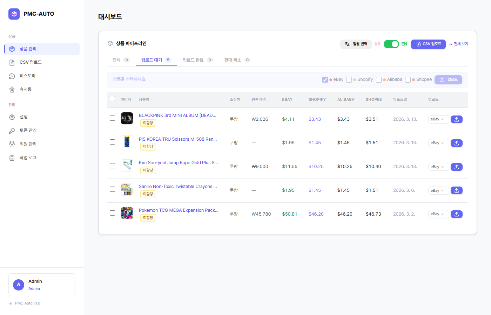

### 탭 구조

4개의 탭으로 상품을 상태별로 분류합니다.

| 탭 | 설명 | 데이터 소스 |
|----|------|-------------|
| **전체** | 리스팅 완료된 상품 | `products` 테이블 (active 상태) |
| **업로드 대기** | CSV로 임포트했으나 아직 플랫폼에 업로드하지 않은 상품 | `crawl_results` (status=new) |
| **업로드 완료** | 플랫폼에 리스팅 완료된 상품 | 리스팅 기록 |
| **판매 취소** | 판매 종료된 리스팅 | 종료된 리스팅 |

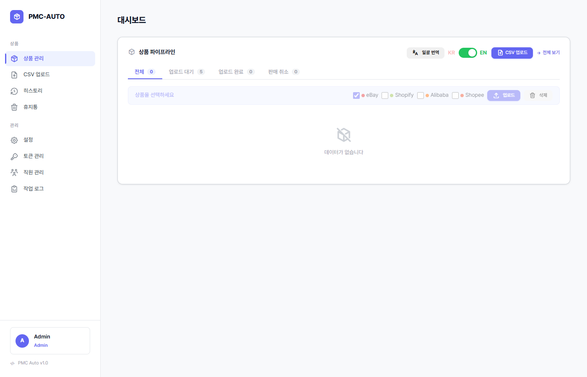

> **참고:** 데이터가 없는 탭은 위와 같이 빈 상태 메시지가 표시됩니다.

### 상단 툴바

① **일괄 번역** — 선택한 상품의 상품명을 Gemini API로 한→영 자동 번역합니다.
② **KR/EN 토글** — 테이블에 표시되는 상품명을 한글/영문으로 전환합니다.
③ **CSV 업로드 링크** — CSV 업로드 페이지로 바로 이동합니다.
④ **전체 보기 링크** — 필터를 초기화하고 전체 상품을 표시합니다.

### 액션바

상품 체크박스를 하나 이상 선택하면 액션바가 활성화됩니다.

① **플랫폼 체크박스** — 업로드할 대상 플랫폼을 선택합니다 (eBay / Shopify / Alibaba / Shopee).
② **업로드 버튼** — 선택한 상품을 체크된 플랫폼에 리스팅합니다.
③ **삭제 버튼** — 선택한 상품을 휴지통으로 이동합니다.

> **주의:** 플랫폼을 하나 이상 체크해야 업로드 버튼이 동작합니다. 실제 업로드 전에 해당 플랫폼의 토큰이 정상 상태인지 [토큰 관리](#토큰-관리)에서 확인하세요.

### 상품 테이블

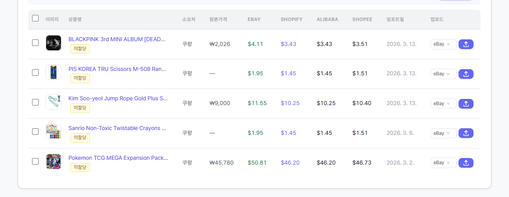

| 열 | 설명 |
|----|------|
| **체크박스** | 상품 선택 (액션바 활성화용) |
| **이미지** | 상품 썸네일 |
| **상품명** | 클릭하여 인라인 편집 가능 |
| **소싱처** | 원본 플랫폼 (쿠팡, ktown4u 등) |
| **원본가격** | 클릭하여 인라인 편집 가능 |
| **플랫폼별 가격** | 설정된 마진/환율/수수료 기반 자동 계산 |
| **임포트일** | CSV로 등록된 날짜 |
| **업로드 버튼** | 개별 상품 업로드 |

**인라인 편집:**

- **상품명**: 텍스트를 클릭하면 입력 필드로 전환됩니다. 수정 후 엔터 또는 포커스 아웃으로 저장합니다.
- **원본가격**: 가격을 클릭하면 수정할 수 있습니다. 변경 시 플랫폼별 가격이 자동으로 재계산됩니다.

**상품 분배 (Admin 전용):**

Admin은 상품을 특정 Staff에게 할당할 수 있습니다. 할당된 상품은 해당 Staff의 대시보드에만 표시됩니다.

---

## CSV 업로드

**URL:** `/upload-csv`

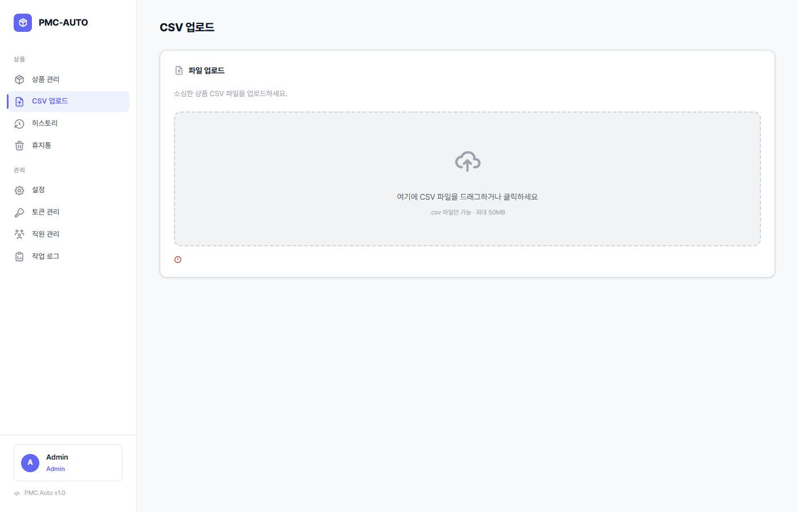

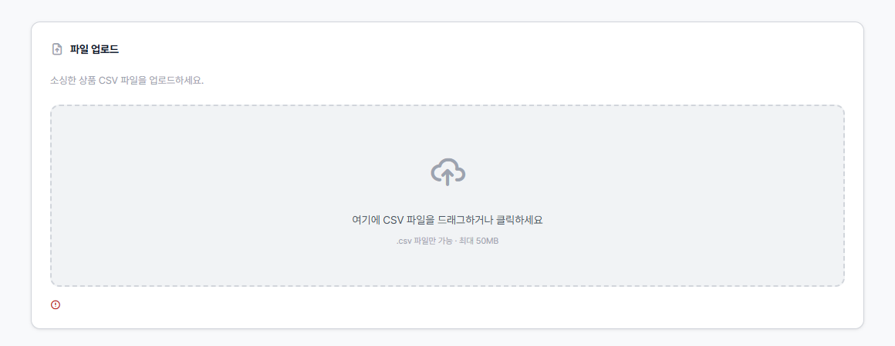

① **드래그앤드롭 영역** — CSV 파일을 끌어다 놓거나, 클릭하여 파일을 선택합니다.

| 항목 | 제한 |
|------|------|
| 허용 확장자 | `.csv` |
| 최대 파일 크기 | 50MB |

② 파일 업로드가 완료되면 자동으로 **데이터 미리보기(Import)** 페이지로 이동합니다.

> **팁:** CSV 파일의 인코딩은 UTF-8을 권장합니다. EUC-KR 파일은 한글이 깨질 수 있습니다.

---

## 데이터 미리보기 (Import)

**URL:** `/import`

CSV에서 파싱된 데이터를 미리보기하는 페이지입니다.

- 최대 **20행**까지 미리보기가 표시됩니다.
- 신규/업데이트/오류 건수가 요약 표시됩니다.
- **"DB에 등록하기"** 버튼을 클릭하면 `crawl_results` 테이블에 데이터가 저장됩니다.
- 등록 완료 후 대시보드의 **업로드 대기** 탭에서 해당 상품을 확인할 수 있습니다.

> **주의:** 동일한 상품이 이미 존재하는 경우 업데이트로 처리됩니다. 오류가 있는 행은 건너뜁니다.

---

## 업로드 진행

**URL:** `/upload`

플랫폼 리스팅이 진행되는 실시간 모니터링 화면입니다.

- **SSE(Server-Sent Events)** 기반으로 실시간 진행률이 표시됩니다.
- 프로그레스 바로 전체 진행률을 확인할 수 있습니다.
- 성공/실패 카운터가 실시간으로 업데이트됩니다.
- 각 상품의 리스팅 결과가 테이블에 순차적으로 추가됩니다.

> **주의:** 업로드 진행 중에는 페이지를 닫거나 새로고침하지 마세요. 진행 상태를 잃을 수 있습니다.

---

## 업로드 결과

**URL:** `/results`

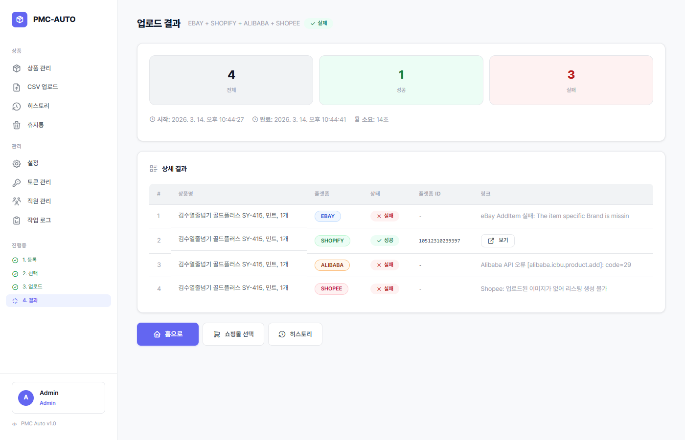

### 결과 요약

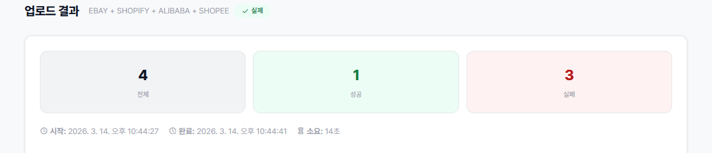

① **전체** — 업로드 시도한 총 상품 수
② **성공** — 플랫폼에 정상적으로 리스팅된 상품 수
③ **실패** — 오류로 리스팅되지 않은 상품 수
④ **시작/완료/소요시간** — 업로드 작업의 시간 정보

### 상세 결과 테이블

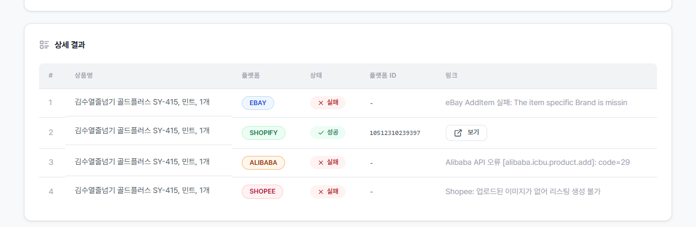

| 열 | 설명 |
|----|------|
| **상품명** | 업로드한 상품의 이름 |
| **플랫폼** | 대상 플랫폼 (eBay, Shopify 등) |
| **상태** | 성공/실패 뱃지 |
| **플랫폼 ID** | 플랫폼에서 부여한 리스팅 ID |
| **링크** | 플랫폼 리스팅 페이지 바로가기 |

---

## 히스토리

**URL:** `/history`

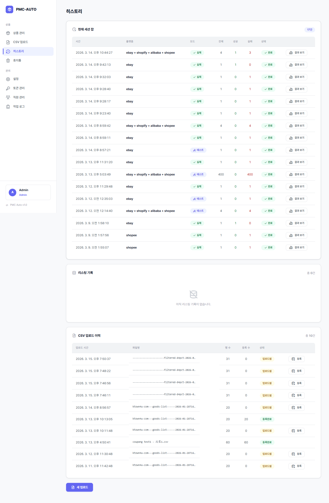

3개의 섹션으로 구성됩니다.

### 현재 세션 잡

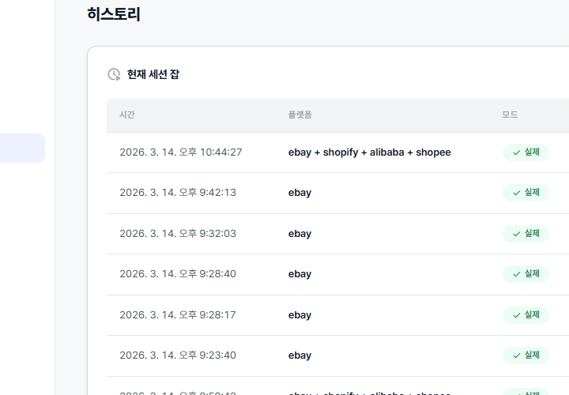

현재 브라우저 세션에서 실행한 업로드 작업 목록입니다.

| 열 | 설명 |
|----|------|
| **시간** | 작업 시작 시간 |
| **플랫폼** | 대상 플랫폼 |
| **모드** | 테스트/실제 구분 |
| **전체/성공/실패** | 처리 건수 |
| **상태** | 진행중/완료/실패 |

### 리스팅 기록

플랫폼에 등록된 전체 리스팅 이력을 조회합니다. 검색 및 필터 기능을 제공합니다.

### CSV 업로드 이력

과거 CSV 업로드 기록을 조회합니다.

| 열 | 설명 |
|----|------|
| **파일명** | 업로드한 CSV 파일 이름 |
| **행 수** | CSV 파일의 총 행 수 |
| **등록 수** | DB에 실제 등록된 행 수 |
| **상태** | 완료/오류 |

---

## 휴지통

**URL:** `/trash`

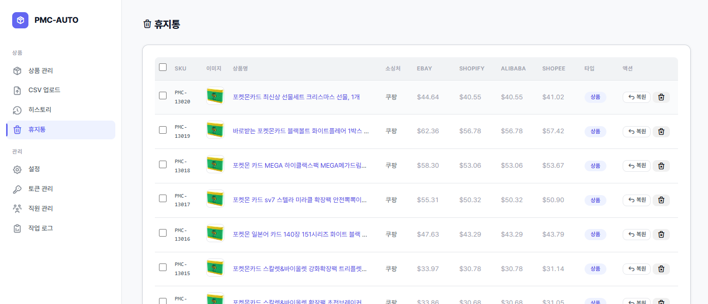

삭제된 상품 및 크롤 결과를 관리합니다.

① **체크박스** — 복원 또는 완전 삭제할 항목을 선택합니다.
② **복원** — 선택한 항목을 원래 위치로 복원합니다.
③ **완전 삭제** — 선택한 항목을 DB에서 영구적으로 삭제합니다.

> **주의:** 완전 삭제된 데이터는 복구할 수 없습니다. 신중하게 사용하세요.

---

## 설정

**URL:** `/settings` (Admin 전용)

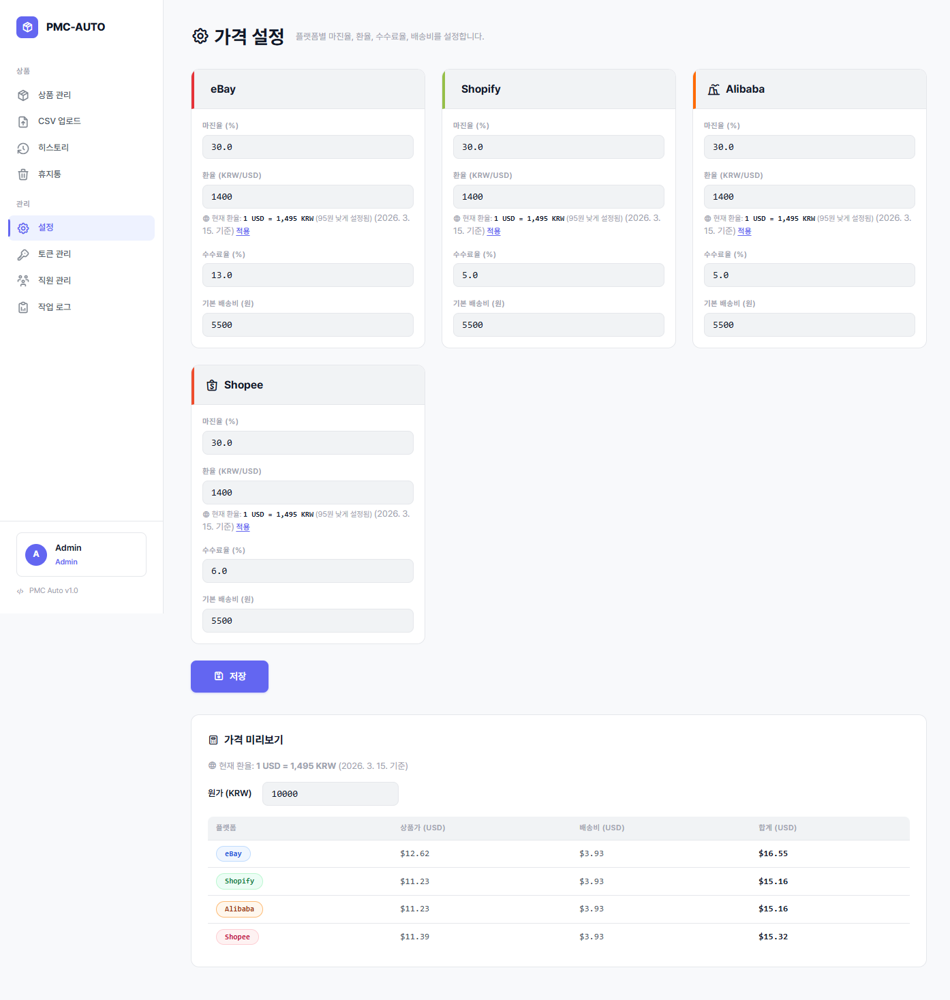

### 플랫폼별 가격 설정

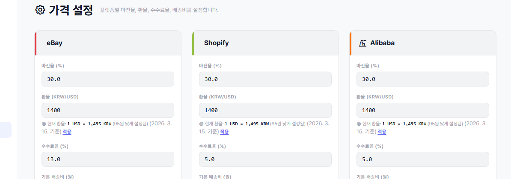

각 플랫폼(eBay, Shopify, Alibaba, Shopee)별로 독립적인 가격 설정 카드가 있습니다.

| 항목 | 설명 |
|------|------|
| **마진율 (%)** | 원가 대비 이익률 |
| **환율 (KRW/USD)** | 원화→달러 환산 비율 |
| **수수료율 (%)** | 플랫폼 판매 수수료 |
| **기본배송비 (원)** | 해외 배송 기본 비용 |

① **실시간 환율 조회** — 현재 환율을 API로 조회합니다.
② **적용 버튼** — 조회한 환율을 설정에 반영합니다.

### 가격 미리보기

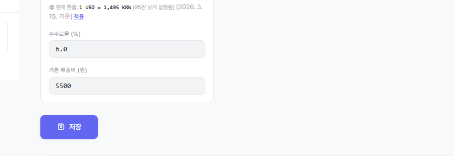

① **원가 입력** — 테스트할 원가(원)를 입력합니다.
② **결과 확인** — 각 플랫폼별 상품가, 배송비, 합계가 자동 계산되어 표시됩니다.

> **팁:** 설정 변경 후 가격 미리보기로 계산 결과를 반드시 확인하세요. 기존에 등록된 상품의 가격도 새 설정에 따라 재계산됩니다.

---

## 토큰 관리

**URL:** `/tokens` (Admin 전용)

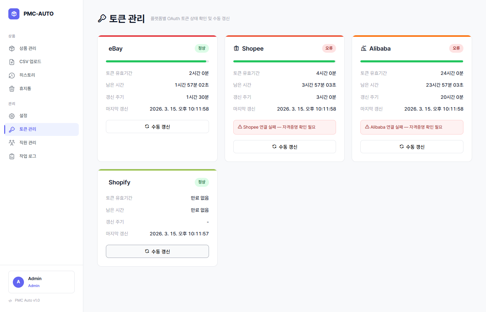

플랫폼별 OAuth 토큰의 상태를 모니터링하고 관리합니다.

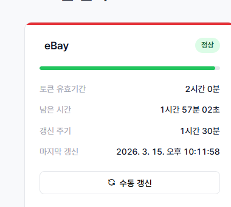

각 토큰 카드에 표시되는 정보:

| 항목 | 설명 |
|------|------|
| **토큰 유효기간** | 토큰 만료 일시 |
| **남은 시간** | 만료까지 남은 시간 (실시간 카운트다운) |
| **갱신 주기** | 자동 갱신 간격 |
| **마지막 갱신** | 최근 토큰 갱신 시간 |

① **프로그레스 바** — 토큰 유효기간 잔여 비율을 시각적으로 표시합니다.
② **상태 뱃지**:
   - 🟢 **정상** (초록) — 토큰이 유효하고 정상 동작 중
   - 🔴 **오류** (빨강) — 토큰 만료 또는 갱신 실패
   - ⚪ **미설정** (회색) — 토큰이 아직 설정되지 않음

③ **수동 갱신 버튼** — 토큰을 즉시 수동으로 갱신합니다.
④ **에러 메시지** — 오류 발생 시 상세 원인이 표시됩니다.

> **주의:** 토큰이 만료되면 해당 플랫폼으로의 업로드가 실패합니다. 오류 상태가 지속되면 해당 플랫폼의 API 키 설정을 확인하세요.

---

## 직원 관리

**URL:** `/staff` (Admin 전용)

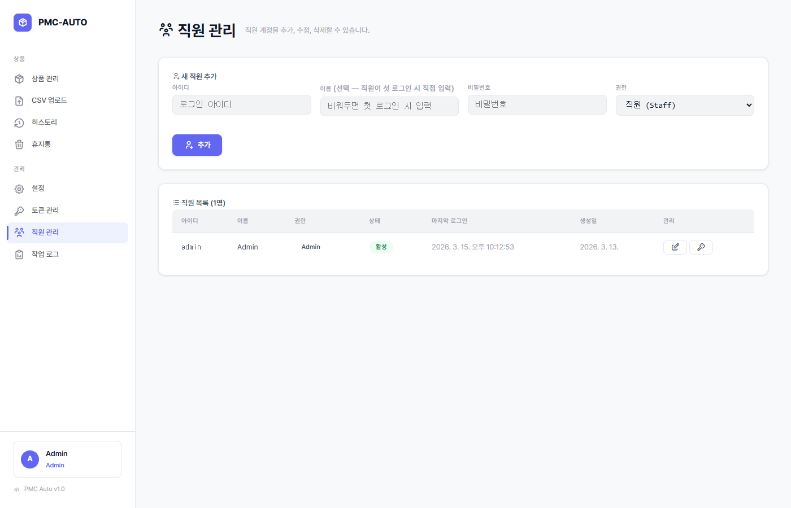

### 새 직원 추가

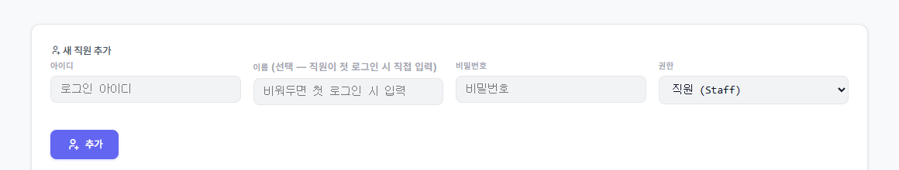

| 필드 | 필수 | 설명 |
|------|------|------|
| **아이디** | 필수 | 로그인에 사용할 고유 아이디 |
| **이름** | 선택 | 표시용 이름 |
| **비밀번호** | 필수 | 초기 비밀번호 |
| **권한** | 필수 | Staff 또는 Admin 선택 |

### 직원 목록

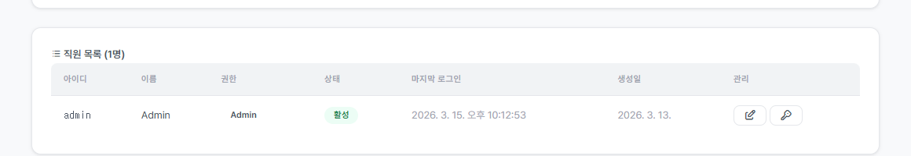

| 열 | 설명 |
|----|------|
| **아이디** | 로그인 아이디 |
| **이름** | 표시 이름 |
| **권한** | Admin / Staff 뱃지 |
| **상태** | 활성 / 비활성 |
| **마지막 로그인** | 최근 접속 시간 |
| **생성일** | 계정 생성 날짜 |

**관리 기능:**

① **수정** — 이름, 권한 등 계정 정보를 수정합니다.
② **비밀번호 초기화** — 해당 직원의 비밀번호를 재설정합니다.
③ **활성/비활성 토글** — 계정을 비활성화하면 로그인이 차단됩니다.
④ **삭제** — 계정을 영구적으로 삭제합니다.

> **팁:** 퇴사한 직원은 삭제 대신 **비활성화**를 권장합니다. 비활성화된 계정은 로그인할 수 없지만 작업 로그에서 기록이 유지됩니다.

---

## 작업 로그

**URL:** `/audit` (Admin 전용)

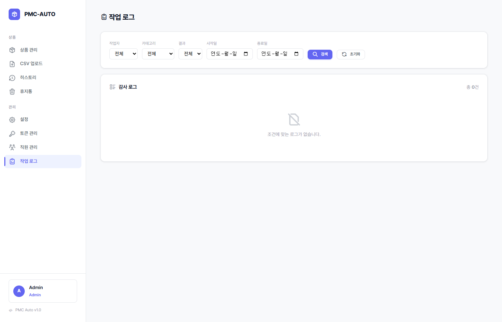

시스템의 모든 주요 작업을 기록하는 감사 로그입니다.

### 필터

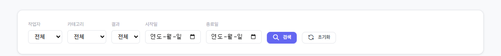

| 필터 | 옵션 |
|------|------|
| **작업자** | 전체 / 특정 사용자 선택 |
| **카테고리** | 리스팅, 상품, 직원관리, 설정, 분배, 임포트, 시스템 |
| **결과** | 성공 / 실패 |
| **기간** | 시작일 ~ 종료일 |

### 감사 로그 테이블

| 열 | 설명 |
|----|------|
| **시간** | 작업 발생 시간 |
| **작업자** | 작업을 수행한 사용자 |
| **액션** | 수행한 작업 내용 |
| **대상** | 작업 대상 (상품명, 직원 아이디 등) |
| **결과** | 성공/실패 뱃지 |
| **상세** | 클릭하여 상세 정보 확인 |

> **팁:** 문제가 발생했을 때 작업 로그에서 해당 시간대의 실패 기록을 확인하면 원인 파악에 도움이 됩니다. 카테고리 필터를 활용하면 특정 유형의 작업만 빠르게 조회할 수 있습니다.
